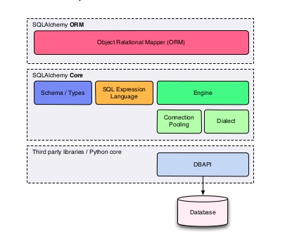
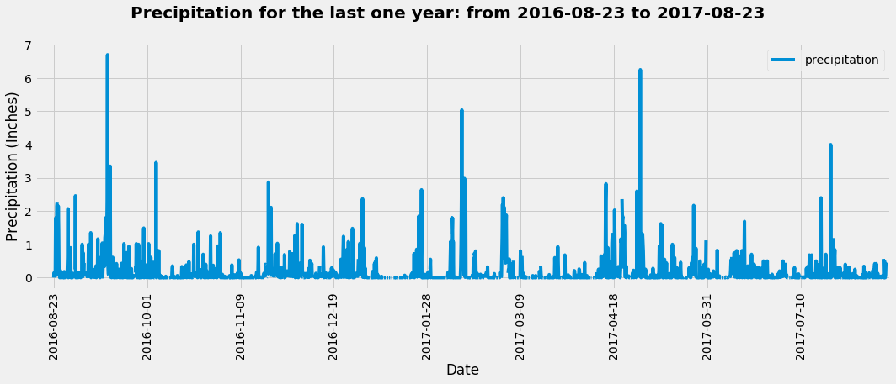

# Surfs Up! - Deep dive in SQL Alchemy

Imagine, You've decided to treat yourself with a long holiday vacation in Honolulu, Hawaii! 
To help with your trip planning, you need to do some climate analysis on the area. What about, doing that with SQL Alchemy? 
**Aʻohe hopohopo, I shall help you with that!**


 

## Why SQL Alchemy ?

Starting with the philosophy, quoting from their [website](https://www.sqlalchemy.org/):

> ### "The main goal of SQLAlchemy is to change the way you think about databases and SQL!"

SQL Alchemy has two distinct components `core` and `Object Relational Mapper(ORM)`. 


- Though ORM is what it is famous for, the core is itself a fully featured SQL abstraction toolkit, which provides a smooth layer of abstraction over Python Database API (DBAPI) for database interactivity to a variety of DBMS, by rendering of textual SQL statements understood by the databases, and schema management.
  
- Whereas, ORM is a specific library built on top of the Core. A third party ORM can be built on top of the core, also, applications can be built directly on top of the core.
  
<div align="center">
<p align="center">
   
</p>
  <p align="center"><b>SQL Alchemy Architecture</b><p align="center">
</div>
  

`Object Relational Mapper` presents a method of associating `user-defined Python classes` with `database tables`, and `instances of those classes (objects)` with `rows in their corresponding tables`. It includes a system that **transparently synchronizes all changes in state between objects and their related rows**, as well as a system for **expressing database queries in terms of the user-defined classes and their defined relationships between each other.** 


We are going to use [ORM](https://docs.sqlalchemy.org/en/13/orm/tutorial.html) to accomplish our tasks as it is the developer's charm !!


## Choice of Data Base - SQLite

SQLite is a serverless Database engine (software library) that allows applications to interact with the database (stored as a single file) without any server process (in contrast to other DB engines like PostgreSQL, MySQL etc.)

<div align="center">
<p align="center">
   
</p>
</div>

As a cherry on top, SQLite comes as preinstalled in recent MAC OS versions.

Because of all of these advantages, SQLite is chosen as the DB for this project.

## Database connection & data retrieval

Establishing a session with the database involves the following steps

1. Create an engine with the database

    ```python
      from sqlalchemy import create_engine
      engine = create_engine("sqlite:///../Resources/hawaii.sqlite", echo=True) 
      #echo=True for seeing the detailed interaction with the database. Turn it off on production code
    ```
1. Optionally, create an inspector and bind to the engine (To inspect the database. I use this for the ease of readability of schema)

    ```python
      from sqlalchemy import inspect
      Inspector = inspect(engine)
    ```
1. Create a base class and instruct the tables to be mapped to the classes directly

    ```python
       Base = automap_base()
       # reflect the tables
       Base.prepare(engine, reflect=True)
    ```
1. Inspect the database tables (or mapped classes), the columns, data types etc. (either via Inspector or Base class)

    ```python
       #via inspector
       [[f"Table name : {table}"]+[f"{col['name']} : {col['type']}{' (primary_key)' if col['primary_key']==1 else None}" \
                              for col in Inspector.get_columns(table)] for table in Inspector.get_table_names()]

       #via Base class
       Base.metadata.tables
       Base.classes.measurement.__dict__ #table1
       Base.classes.station.__dict__ #table2

    ```
1. Save the mapped table references (classes) to variables, so that we can query them later

    ```python

       Measurement = Base.classes.measurement
       Station = Base.classes.station

    ```
1. Create a session and map that to engine

    ```python
       session = Session(bind=engine)
    ```

**Now, we can access the tables and retrieve the data through session by querying the classes!!**  
  
 
  

# Analysis
## Climate Analysis and Exploration

Use Python and SQLAlchemy to do basic climate analysis and data exploration of your climate database. All of the following analysis should be completed using SQLAlchemy ORM queries, Pandas, and Matplotlib.

* Use the provided [starter notebook](climate_starter.ipynb) and [hawaii.sqlite](Resources/hawaii.sqlite) files to complete your climate analysis and data exploration.

* Choose a start date and end date for your trip. Make sure that your vacation range is approximately 3-15 days total.

* Use SQLAlchemy `create_engine` to connect to your sqlite database.

* Use SQLAlchemy `automap_base()` to reflect your tables into classes and save a reference to those classes called `Station` and `Measurement`.

## Precipitation Analysis

* Design a query to retrieve the last 12 months of precipitation data. Select only the `date` and `prcp` values.

    ```python
    ### Calculate the date 1 year ago from the last data point in the database
    last_date = session.query(Measurement.date).order_by(Measurement.date.desc()).limit(1).scalar()

    ### Last one year mark in the dataset
    One_year_mark = dt.datetime.strptime(last_date, "%Y-%m-%d")-dt.timedelta(days=366)
    
    ### Perform a query to retrieve the data and precipitation scores
    last_one_year_prcp = session.query(Measurement.date, Measurement.prcp).filter(
    (Measurement.date >= One_year_mark)).order_by(Measurement.date).all()

    ```

* Load the query results into a Pandas DataFrame and set the index to the date column.

    ```python
    ### Save the query results as a Pandas DataFrame and set the index to the date column
    last_one_year_prcp_DF = pd.DataFrame(last_one_year_prcp, columns=['Date','precipitation'])
    last_one_year_prcp_DF.set_index('Date', inplace=True)
    #There are 208 NUll prcp values    
    ```

* Sort the DataFrame values by `date`.

    ```python
    ### Sort the dataframe by date (Though the data is sorted initially, creating DF from the data changes the order)
    last_one_year_prcp_DF.sort_index(inplace=True)
       
    ```

* Plot the results using the DataFrame `plot` method.
    
    ```python
    fig, ax = plt.subplots(figsize=(15,6))
    _=last_one_year_prcp_DF.plot(ax=ax)

    ### Annotation and labelling
    xticks = np.arange(0,len(last_one_year_prcp_DF)+1,250)
    xticklabels = last_one_year_prcp_DF.index[xticks].to_list()
    plt.ylabel("Inches")
    _=plt.suptitle(f"Precipitation for the last one year: from {last_one_year_prcp_DF.index.min()} to {last_one_year_prcp_DF.index.max()}", fontsize=20,        weight='bold', y=1.06)
    _=plt.xlim((-50,len(last_one_year_prcp_DF)+10))
    _=plt.xticks(xticks, xticklabels, rotation=90)
    _=plt.tight_layout()
    _= plt.savefig('../Images/Last_one_year_precipitation.png', bbox_inches = "tight" )
       
    ```


    
    

* Use Pandas to print the summary statistics for the precipitation data.

    ```python
    # Use Pandas to calcualte the summary statistics for the precipitation data
    last_one_year_prcp_DF.describe()
       
    ```
    
    

## Station Analysis

* Design a query to calculate the total number of stations.

* Design a query to find the most active stations.

  * List the stations and observation counts in descending order.

  * Which station has the highest number of observations?

  * Hint: You will need to use a function such as `func.min`, `func.max`, `func.avg`, and `func.count` in your queries.

* Design a query to retrieve the last 12 months of temperature observation data (TOBS).

  * Filter by the station with the highest number of observations.

  * Plot the results as a histogram with `bins=12`.

    

- - -

# Climate App

Now that you have completed your initial analysis, design a Flask API based on the queries that you have just developed.

* Use Flask to create your routes.

## Routes

* `/`

  * Home page.

  * List all routes that are available.

* `/api/v1.0/precipitation`

  * Convert the query results to a dictionary using `date` as the key and `prcp` as the value.

  * Return the JSON representation of your dictionary.

* `/api/v1.0/stations`

  * Return a JSON list of stations from the dataset.

* `/api/v1.0/tobs`
  * Query the dates and temperature observations of the most active station for the last year of data.
  
  * Return a JSON list of temperature observations (TOBS) for the previous year.

* `/api/v1.0/<start>` and `/api/v1.0/<start>/<end>`

  * Return a JSON list of the minimum temperature, the average temperature, and the max temperature for a given start or start-end range.

  * When given the start only, calculate `TMIN`, `TAVG`, and `TMAX` for all dates greater than and equal to the start date.

  * When given the start and the end date, calculate the `TMIN`, `TAVG`, and `TMAX` for dates between the start and end date inclusive.

## Hints

* You will need to join the station and measurement tables for some of the queries.

* Use Flask `jsonify` to convert your API data into a valid JSON response object.

- - -

## Bonus: Other Recommended Analyses

* The following are optional challenge queries. These are highly recommended to attempt, but not required for the homework.

### Temperature Analysis I

* Hawaii is reputed to enjoy mild weather all year. Is there a meaningful difference between the temperature in, for example, June and December?

* You may either use SQLAlchemy or pandas's `read_csv()` to perform this portion.

* Identify the average temperature in June at all stations across all available years in the dataset. Do the same for December temperature.

* Use the t-test to determine whether the difference in the means, if any, is statistically significant. Will you use a paired t-test, or an unpaired t-test? Why?

### Temperature Analysis II

* The starter notebook contains a function called `calc_temps` that will accept a start date and end date in the format `%Y-%m-%d`. The function will return the minimum, average, and maximum temperatures for that range of dates.

* Use the `calc_temps` function to calculate the min, avg, and max temperatures for your trip using the matching dates from the previous year (i.e., use "2017-01-01" if your trip start date was "2018-01-01").

* Plot the min, avg, and max temperature from your previous query as a bar chart.

  * Use the average temperature as the bar height.

  * Use the peak-to-peak (TMAX-TMIN) value as the y error bar (YERR).

    

### Daily Rainfall Average

* Calculate the rainfall per weather station using the previous year's matching dates.

* Calculate the daily normals. Normals are the averages for the min, avg, and max temperatures.

* You are provided with a function called `daily_normals` that will calculate the daily normals for a specific date. This date string will be in the format `%m-%d`. Be sure to use all historic TOBS that match that date string.

* Create a list of dates for your trip in the format `%m-%d`. Use the `daily_normals` function to calculate the normals for each date string and append the results to a list.

* Load the list of daily normals into a Pandas DataFrame and set the index equal to the date.

* Use Pandas to plot an area plot (`stacked=False`) for the daily normals.

  


